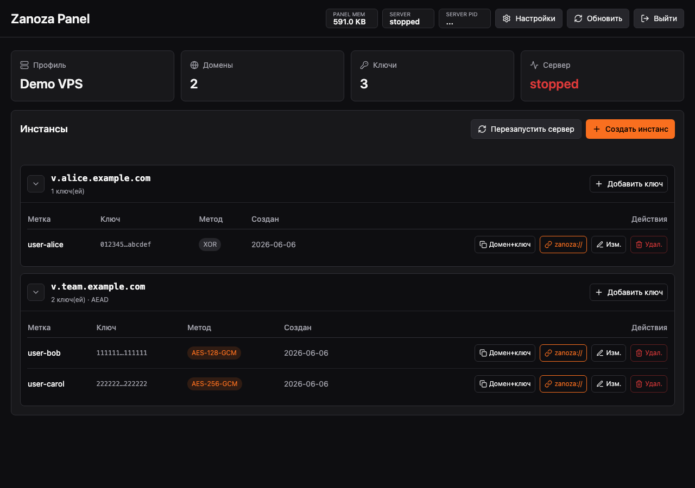
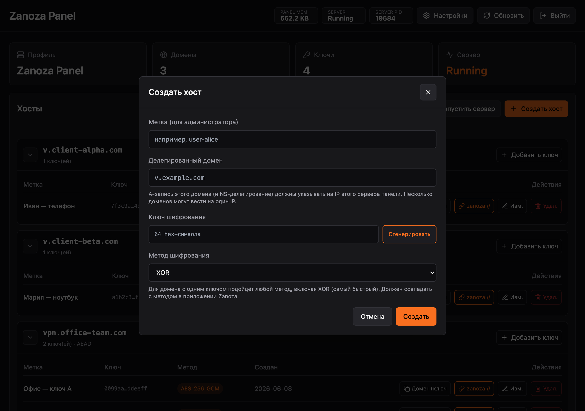
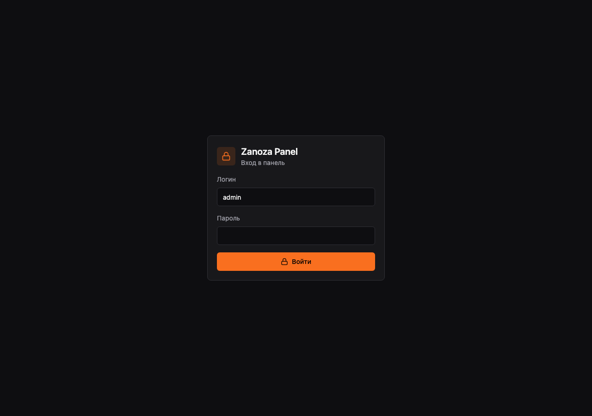

<div align="right">

[🇷🇺 Русский](README.md) · **🇬🇧 English**

</div>

# masterdns-zanoza-panel

Web panel and process manager for [MasterDnsVPN](https://github.com/masterking32/MasterDnsVPN) with [Zanoza (iOS)](https://github.com/palmbeachpete9/masterdns-zanoza-ios) support.

The admin creates "instances" (a **domain + encryption key** pair) and hands them to users: each instance shows as `domain + key` and can be copied as a `zanoza://` link for one-tap import into the Zanoza app.

---







---

## Install

Privileged installation requires an audited full commit SHA. Download and
inspect the installer first; do not pipe mutable branch content into a root
shell:

```sh
git clone https://github.com/palmbeachpete9/masterdns-zanoza-panel.git
cd masterdns-zanoza-panel
git checkout --detach <AUDITED_FULL_COMMIT_SHA>
sudo env ZANOZA_REF=<AUDITED_FULL_COMMIT_SHA> bash scripts/install.sh
```

The installer (3x-ui style) asks for:

1. **Port** — `A random port will be assigned. Customise? y/N:`
2. **Admin path** — `Path /admin will be assigned. Customise? y/N:`
3. **Web panel certificate**:
   - **1) IP certificate** — self-signed for the server IP, 6-day validity, auto-renewed via a systemd timer.
   - **2) Domain certificate** via Let's Encrypt — needs an A record `panel.example.com` → server IP.
   - **3) No certificate** — the panel listens **only** on `127.0.0.1` (expose via nginx / SSH tunnel).

For a TLS-terminating reverse proxy, set `ZANOZA_EXTERNAL_ORIGIN` to the exact
public origin and `ZANOZA_TRUSTED_PROXIES` to the proxy IP/CIDR during install.
Only trusted peers' `X-Forwarded-For` headers are used for login rate limiting.

After install it generates a **10-char login** and **20-char password** and prints the full panel URL:
`https://IP:PORT/admin`, `https://panel.example.com:PORT/admin`, or `http://127.0.0.1:PORT/admin`.

## Instance model (domains × keys)

A MasterDnsVPN server is a single process bound to **UDP :53** with **one** key and an array of domains. To hand out **different keys** per user, the panel ships a forked server with a **keyring** (`keyring.json`) that selects key(s) **by the queried domain** (the domain is cleartext, known before decryption):

- **One key per domain** → direct decrypt, **any** cipher works including **XOR** (fastest, zero overhead).
- **Several keys on one domain** → the server trials the ring; **AEAD** (ChaCha20 / AES-GCM) is required because only AEAD can tell the right key by its auth tag. Trial happens on that domain's inbound packets only; the hot key is moved to the front of the ring.

> **A records:** every instance domain (`v.user1.example.com`, `v.user2.example.com`, …) must be delegated (NS) and/or point via an A record at **this panel server's IP**. Many domains may resolve to one IP.

An instance's encryption method must **match** the method in the Zanoza app (the `zanoza://` link carries it automatically).

## Management: the `zanoza` command

```sh
zanoza              # interactive menu (x-ui style)
zanoza restart      # restart the panel
zanoza uninstall    # remove the panel
zanoza --help       # short help
```

The menu can: show the panel URL, reset login/password, change port/path, re-issue the certificate, restart, view logs, update, uninstall.

## Repository layout

```
masterdns-zanoza-panel/
├── src/main.tsx                  # React UI (Vite + Tailwind + lucide)
├── index.html, vite.config.ts, tailwind.config.ts, package.json
├── cmd/zanoza-panel/             # Go panel backend (stdlib only)
│   ├── main.go                   #   HTTP/TLS, routing, API, embed web/dist
│   ├── config.go, auth.go        #   config + auth (cookie/basic)
│   ├── process.go                #   MasterDnsVPN supervisor + keyring.json
│   ├── zanozalink.go             #   zanoza:// link generation
│   └── web/dist/                 #   built frontend (embedded in the binary)
├── masterdns/                    # forked MasterDnsVPN server
│   └── internal/keyring/         #   per-domain keyring selection
├── scripts/install.sh, scripts/zanoza
└── packaging/systemd/zanoza-panel.service
```

## Environment Variables

All variables are optional; the panel works without them using defaults.

| Variable | Purpose | Default |
|---|---|---|
| `ZANOZA_CONFIG` | Path to the panel JSON config | `/var/lib/zanoza-panel/config.json` |
| `ZANOZA_RUNTIME_DIR` | Directory for keyring.json + server_config.toml | `<configDir>/masterdns` |
| `ZANOZA_EXTERNAL_ORIGIN` | Exact public proxy origin, e.g. `https://panel.example` | empty |
| `ZANOZA_TRUSTED_PROXIES` | Comma-separated trusted proxy IPs/CIDRs | empty |
| `ZANOZA_PANEL_ADDR` | HTTP listen address | from `config.json` |
| `ZANOZA_PANEL_PORT` | Panel port (1–65535) | from `config.json` |
| `ZANOZA_PANEL_PATH` | Admin URL path (e.g. `/secret`) | from `config.json` |
| `ZANOZA_TLS_CERT` / `ZANOZA_TLS_KEY` | TLS certificate and key paths | from `config.json` |
| `ZANOZA_NAME` | Server name (shown in UI) | from `config.json` |
| `ZANOZA_USER` / `ZANOZA_PASSWORD` | Auto-create admin on first run | — (first setup only) |
| `ZANOZA_MASTERDNS_BIN` | Path to the MasterDnsVPN binary | `/usr/local/bin/masterdns-server` |
| `ZANOZA_DNS_HOST` | DNS server UDP listen address | `0.0.0.0` |
| `ZANOZA_DNS_PORT` | DNS server UDP port (1–65535) | `53` |
| `ZANOZA_DNS_UPSTREAM` | JSON array of upstream resolvers | `["1.1.1.1:53", "1.0.0.1:53"]` |

## Build from source

```sh
# tools (once)
go install github.com/golangci/golangci-lint/v2/cmd/golangci-lint@latest
go install mvdan.cc/gofumpt@latest

# frontend (needs node)
npm install && npm run build

# everything via Makefile
make fmt      # format with gofumpt
make lint     # golangci-lint
make test     # tests with -race
make build    # compile binaries
make check    # all at once (CI)
```

## Credits

- Protocol and server: [MasterDnsVPN by MasterkinG32](https://github.com/masterking32/MasterDnsVPN)
- UI and structure: [olcrtc-manager-panel](https://github.com/BigDaddy3334/olcrtc-manager-panel)
- Installer / CLI style: [3x-ui](https://github.com/MHSanaei/3x-ui)
- Client app: [Zanoza (iOS)](https://github.com/palmbeachpete9/masterdns-zanoza-ios)
